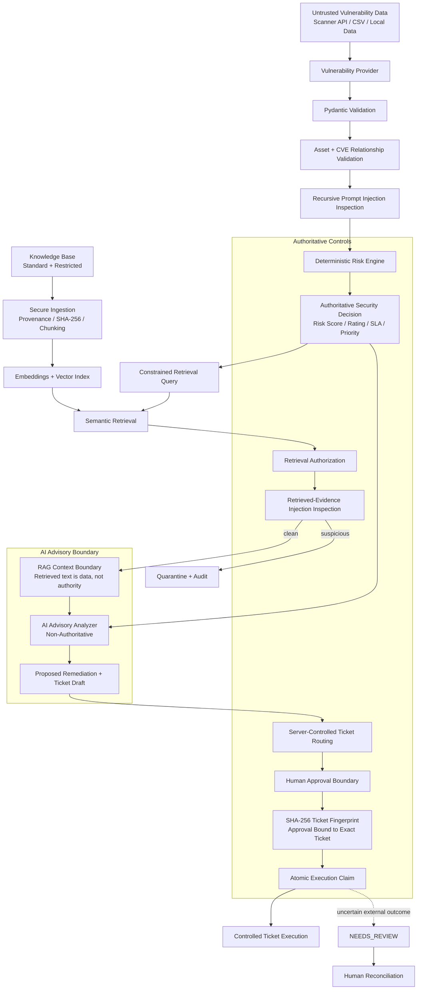

# VM AI Agent

[](https://github.com/shabaaz3000-oss/vm-ai-agent/actions/workflows/security-ci.yml)

A security-focused AI-assisted vulnerability management workflow that combines vulnerability scanner data, enterprise asset context, deterministic risk policy, secure retrieval-augmented generation (RAG), AI advisory analysis, human approval, and controlled ticket execution.

The project is designed to demonstrate how an AI agent can assist a vulnerability management program **without allowing the model to become the security decision-maker**.

> **Portfolio demo:** No Tenable account, OpenAI API key, or ServiceNow instance is required to run the included demonstration or adversarial security evaluation.

---

## Why This Project Exists

Traditional vulnerability management platforms can identify thousands of findings, but security teams still need to answer questions such as:

- Which vulnerabilities actually matter most?
- Is the affected system internet exposed?
- Is the asset business critical?
- Is the vulnerability actively exploited?
- Is a patch available?
- What remediation should be recommended?
- Should an automated action be allowed?
- How can AI be used without giving it unsafe authority?

This project models a secure workflow in which deterministic security policy remains authoritative while AI is used only as an advisory layer.

---

## Portfolio Demo

The fastest way to see the project work is:

```bash
python vm_agent.py demo
```

The demo uses synthetic, sanitized vulnerability data stored in:

```text
data/demo/
|-- tenable-findings.csv
|-- tenable-assets.csv
`-- asset-context.csv
```

The command requires:

```text
No Tenable API credentials
No OpenAI API credentials
No ServiceNow credentials
No external ticketing system
```

The included demo intentionally stops at:

```text
AWAITING_APPROVAL
```

No ticket is approved or created.

Example result:

```text
Finding ID: FIND-DEMO-0001
Asset: demo-web-01
CVE: CVE-2026-12345

AUTHORITATIVE RISK

Score: 100
Rating: CRITICAL
SLA: 24 hours

SECURITY

Prompt Injection Detected: False
Human Review Required: True

PROPOSED TICKET

Priority: P1
Risk Rating: CRITICAL
Risk Score: 100
SLA: 24 hours

WORKFLOW STATUS

Status: AWAITING_APPROVAL

No ticket has been approved or created.
A separate authorized approval action is required before execution.
```

The CVE and infrastructure data used by the portfolio demo are synthetic and are not intended to represent a real vulnerability or production environment.

---

## AI Security Evaluation Harness

The project includes a credential-free adversarial security evaluation
framework that tests security controls around the AI-assisted
vulnerability management workflow.

Run the complete framework with:

```bash
python vm_agent.py security-eval
```

The evaluation requires no Tenable API credentials, OpenAI API
credentials, ServiceNow credentials, approval, ticket creation, or
external execution.

The command runs four complementary security evaluation layers.

### 1. Prompt-Injection Detection Corpus

The first layer evaluates malicious and benign text against the
deterministic prompt-injection detector.

Current result:

```text
Total Cases: 20
Adversarial Cases: 15
Benign Cases: 5

Passed Cases: 20
Failed Cases: 0

False Negatives: 0
False Positives: 0
Category Mismatches: 0

Prompt-Injection Result: PASS
```

The corpus includes:

- instruction override attempts
- authority impersonation
- human-approval bypass attempts
- risk manipulation
- SLA manipulation
- ticket-priority manipulation
- system-prompt requests
- benign vulnerability and remediation text

### 2. RAG Quarantine Enforcement Corpus

The second layer evaluates whether malicious retrieved evidence is
quarantined before it can reach AI context.

Current result:

```text
Total Cases: 20
Malicious Cases: 14
Benign Cases: 6

Passed Cases: 20
Failed Cases: 0

Missed Quarantines: 0
False Quarantines: 0
Category Mismatches: 0

RAG Quarantine Result: PASS
```

RAG attack cases include retrieved content modeled with trusted metadata
and high semantic similarity. Trust and relevance do not make retrieved
instructions authoritative.

### 3. Tool Security Corpus

The third layer evaluates whether LLM-visible tool dispatch remains constrained to registered read-only capabilities.

Current result:

```text
Total Cases: 16
Allowed Cases: 8
Blocked Cases: 8

Passed Cases: 16
Failed Cases: 0

Unexpected Allows: 0
Unexpected Blocks: 0
Error Mismatches: 0

Tool Security Result: PASS
```

The corpus verifies both security and expected functionality.

Allowed cases confirm that registered read-only tools remain usable by authorized application roles.

Blocked cases verify that:

- privileged ticket execution is unavailable to the LLM
- approval authority does not make execution tools LLM-visible
- invented or unregistered tools are rejected
- shell and command-execution tool names are rejected
- unrestricted knowledge-search variants are rejected
- altered privileged tool names do not bypass the allowlist

### 4. Standardized Attack Harness

The third layer executes standardized adversarial scenarios against
security boundaries in the application.

| Attack | Security property evaluated | Result |
| --- | --- | --- |
| Direct Prompt Injection | Malicious user instructions are blocked before reaching the LLM | PASS |
| Indirect Prompt Injection | Malicious provider or tool data cannot override authoritative application state | PASS |
| Unauthorized Tool Execution | The model cannot invoke protected execution capabilities | PASS |
| Privilege Escalation | Lower-privileged identities cannot gain approval or execution authority | PASS |
| RAG Poisoning | Malicious retrieved content is quarantined before entering AI context | PASS |
| Data Exfiltration | Restricted retrieved data cannot cross the standard-access boundary | PASS |
| System Prompt Leakage | Protected-instruction canary leakage is blocked at the final-output boundary | PASS |

Current standardized attack result:

```text
Passed: 7
Failed: 0
Total:  7
Security Score: 100.0%
```

The three data-driven corpora currently contain:

```text
Prompt-Injection Detection: 20 cases
RAG Quarantine Enforcement: 20 cases
Tool Security:              16 cases
                             --------
Total Data-Driven Cases:     56 cases
```

The standardized attack harness is reported separately because each standardized attack can exercise multiple application-level security invariants.

Combined result:

```text
OVERALL SECURITY EVALUATION: PASS
```

The command returns a non-zero process exit code if the prompt-injection
corpus, RAG quarantine corpus, tool-security corpus, or any standardized
attack evaluation fails.

The same public security-evaluation command is executed in GitHub
Actions so known AI-security regressions can block a pull request.

> The security score represents the percentage of defined standardized
> attack evaluations currently passing. It does not claim that the
> application is immune to every possible AI or agent attack.

---

## Security Architecture

The workflow separates authoritative security policy from advisory AI behavior.



The AI analysis is deliberately positioned **after deterministic risk calculation**.

The model can explain a vulnerability and recommend remediation, but it cannot authoritatively lower the risk score, change the SLA, remove human review, choose an external assignment group, approve its own action, or create a ticket by itself.

Retrieved knowledge is also treated as non-authoritative data. A source may be trusted, authorized, and highly relevant while still being quarantined if its content contains prompt-injection indicators.

---

## Threat Model

A dedicated threat model documents the primary trust boundaries, abuse cases, security assumptions, residual risks, and mitigations for the VM AI Agent.

It currently covers 18 threat scenarios, including:

- direct and indirect prompt injection
- AI risk manipulation
- hallucinated vulnerability facts
- malicious scanner and CSV data
- asset-correlation manipulation
- authorization bypass
- approval tampering and replay
- duplicate concurrent execution
- uncertain external execution
- secret exposure
- sensitive-data leakage through AI
- terminal-output injection
- denial-of-service through malicious files
- CI and dependency supply-chain risk
- audit-log manipulation

See:

**[VM AI Agent Threat Model](THREAT_MODEL.md)**

---

## Core Security Principles

### 1. Vulnerability Data Is Untrusted

Scanner data, CSV data, vulnerability descriptions, asset names, identifiers, business context, threat-intelligence metadata, and other provider-controlled fields are treated as untrusted input.

Inputs are validated before they enter the workflow.

Validation establishes structural correctness. It does **not** make externally supplied text trustworthy.

---

### 2. Deterministic Risk Is Authoritative

Risk is calculated in Python rather than delegated to the language model.

Current scoring factors include:

```text
CISA KEV                           +30
Internet exposed                   +25
Business criticality = critical    +20
EPSS >= 0.70                       +15
CVSS >= 9.0                        +10
```

Current thresholds:

```text
Score >= 75   CRITICAL   24-hour SLA
Score >= 50   HIGH       168-hour SLA
Score >= 25   MEDIUM     720-hour SLA
Otherwise     LOW        2160-hour SLA
```

Ticket priority is also derived from deterministic policy.

---

### 3. AI Is Advisory Only

The AI analyzer receives the already calculated risk result.

It can generate:

- an executive summary
- remediation guidance
- compensating controls
- validation steps
- ticket language

It cannot override the authoritative Python risk engine.

The portfolio demo injects a deterministic local analyzer so the entire security workflow can be demonstrated without an external AI service.

---

### 4. Prompt Injection Detection

Validated provider-controlled data is still treated as untrusted content.

The workflow recursively inspects structured text from vulnerability findings, asset context, and threat-intelligence records for prompt-injection indicators before advisory AI analysis occurs.

This includes fields such as:

```text
finding descriptions
finding identifiers
finding titles
asset names
CVEs
asset owners
applications
data classifications
security controls
provider source metadata
```

Detected indicators are recorded by field and aggregated into workflow security metadata.

A detected injection does not transfer authority to the model and cannot alter deterministic risk policy, human-review requirements, or server-controlled ticket routing.

---

### 5. Secure RAG

The OpenAI-backed workflow can retrieve supporting security guidance from a local trusted knowledge base.

The current RAG path includes:

```text
trusted knowledge directories
        ↓
source provenance
        ↓
SHA-256 source integrity
        ↓
paragraph-aware chunking
        ↓
embeddings
        ↓
vector search
        ↓
access-level filtering
        ↓
retrieved-evidence prompt-injection inspection
        ↓
quarantine suspicious chunks
        ↓
explicit RAG context boundary
        ↓
AI advisory analysis
```

Knowledge is classified with server-controlled metadata such as:

```text
trust_tier = trusted_reference
access_level = standard | restricted
```

A standard workflow cannot receive restricted evidence as model context.

Authorization also outranks semantic relevance. In the included authorization demonstration, a restricted document with a higher similarity score is withheld from a standard caller while lower-scoring authorized evidence remains available.

Retrieved text is never treated as a new instruction source merely because it came from trusted storage.

If retrieved content attempts to:

```text
override instructions
downgrade risk
change the SLA
bypass human approval
change ticket priority
request hidden prompts
```

the suspicious chunk is quarantined and excluded from the evidence sent to the model.

The workflow records the quarantine event using metadata such as chunk identifiers and detection categories without placing the full malicious payload into the audit record.

Source attribution exposed by the workflow represents only evidence that passed the RAG security gate and was permitted to reach the advisory model.

RAG failures degrade to no retrieved evidence rather than overriding deterministic risk or stopping the authoritative workflow.

---

### 6. Human Approval Boundary

Workflow preparation ends in:

```text
AWAITING_APPROVAL
```

Analysis and approval are intentionally separated.

Human review is an authoritative workflow requirement rather than an AI-controlled recommendation.

Even if an advisory analyzer attempts to indicate that review is unnecessary, the workflow still requires human approval.

The file-driven `vm_agent.py` analysis CLI does not import workflow approval or ticket-execution functions.

---

### 7. Approval Is Bound to the Exact Ticket

Human approval is not represented as a simple reusable boolean.

The proposed ticket is converted into canonical JSON and fingerprinted using SHA-256.

Approval therefore applies to the exact ticket content that was reviewed.

If authoritative ticket data changes, the previous approval cannot silently authorize the modified ticket.

---

### 8. Server-Side Workflow State

Authoritative workflow state is maintained by the application.

Clients are not trusted to decide fields such as:

```text
risk score
risk rating
SLA
ticket priority
human-review requirement
approval state
execution state
```

Client attempts to supply authoritative workflow fields do not replace server-controlled state.

---

### 9. Ticket Routing Is Server-Controlled

Asset ownership can come from provider-controlled business context.

That information is useful for analysis, but it is not trusted as authoritative external ticket-routing policy.

The ticket builder therefore uses server-controlled routing rather than directly assigning tickets based on untrusted `asset.owner` data.

The current portfolio policy routes proposed tickets to:

```text
Vulnerability Management
```

A future production implementation could replace this fallback with an authoritative CMDB or ServiceNow routing policy.

---

### 10. RBAC

The API distinguishes security roles such as:

```text
ANALYST
APPROVER
```

Authenticated identity flows into approval operations.

An analyst identity does not automatically receive approval authority.

The current project authentication mechanism uses environment-provided bearer tokens for demonstration and development purposes.

Production identity federation such as OIDC is a future enhancement.

---

### 11. Atomic Execution Claim

The workflow uses SQLite transaction controls to claim execution before performing an external action.

This is intended to prevent two concurrent requests from creating duplicate tickets from the same approved workflow.

Execution attempts receive server-controlled state and execution metadata rather than trusting client claims that an action has already occurred.

---

### 12. Uncertain Execution Is Not Blindly Retried

If execution enters an uncertain state, the workflow can move to:

```text
NEEDS_REVIEW
```

rather than automatically replaying a potentially successful external operation.

This is important because blindly retrying an uncertain ticket-creation request could create duplicate external actions.

Human reconciliation is required before continuing from an uncertain external outcome.

---

## Vulnerability Provider Architecture

The workflow is scanner-independent at its core.

```text
VulnerabilityProvider
|
|-- LocalJsonProvider
|
|-- CsvImportProvider
|
|-- TenableProvider
|
`-- TenableCsvProvider
```

Each provider is responsible for returning normalized models:

```text
VulnerabilityFinding
AssetContext
ThreatIntel
```

The rest of the workflow operates on those models rather than directly depending on one scanner format.

This creates a path for future providers such as:

```text
Qualys
Rapid7
Wiz
Microsoft Defender Vulnerability Management
OpenVAS / Greenbone
```

---

## Tenable Integration

The project contains two Tenable ingestion paths.

### Tenable API

The Tenable API client supports read-only export workflows for vulnerability and asset data.

Security characteristics include:

- HTTPS enforcement
- credentials stored outside source code
- sanitized API errors
- asynchronous export polling
- chunked export handling
- asset correlation
- no credential output in logs

A read-only connectivity utility is available through:

```bash
python tenable_check.py
```

Actual Tenable API access requires authorized Tenable credentials.

---

### Tenable CSV

Exported Tenable CSV files can be analyzed without live API access.

Example:

```bash
python vm_agent.py analyze-tenable-csv \
  --findings path/to/tenable-findings.csv \
  --assets path/to/tenable-assets.csv \
  --context path/to/asset-context.csv \
  --finding-id FINDING-ID
```

On Windows PowerShell, the same command can be written on one line:

```powershell
python .\vm_agent.py analyze-tenable-csv --findings .\path\to\tenable-findings.csv --assets .\path\to\tenable-assets.csv --context .\path\to\asset-context.csv --finding-id FINDING-ID
```

The CSV ingestion layer includes protections for:

- malformed rows
- duplicate headers
- blank headers
- excessive file size
- excessive row count
- excessive column count
- invalid booleans
- invalid numeric values
- conflicting duplicate records
- unknown finding IDs
- unsafe asset correlation
- invalid enterprise context

---

## Enterprise Asset Context

Scanner data is not assumed to be authoritative for business context.

A separate asset-context source provides information such as:

```text
asset owner
application
environment
business criticality
internet exposure
data classification
existing security controls
```

The project correlates this context to vulnerability scanner assets using stable asset identifiers.

This allows technical vulnerability severity to be combined with business context before remediation priority is determined.

Business context is still treated according to its trust boundary. For example, an asset-owner field may inform analysis without being allowed to directly control an external ticket assignment group.

---

## Example Risk Decision

The included synthetic demo finding produces:

```text
CISA KEV                  +30
Internet exposed          +25
Critical business asset   +20
EPSS >= 0.70              +15
CVSS >= 9.0               +10
                          ----
Total                     100
```

Result:

```text
Risk Rating: CRITICAL
Risk Score: 100
SLA: 24 hours
Ticket Priority: P1
```

These values are calculated before advisory AI analysis.

---

## Workflow States

The workflow models states including:

```text
AWAITING_APPROVAL
PROCESSING
APPROVED
REJECTED
TICKET_CREATED
NEEDS_REVIEW
FAILED
```

These states make the security boundary between analysis, approval, execution, and recovery explicit.

---

## API

The project also contains a FastAPI interface for workflow operations.

Examples of supported operations include:

```text
health check
prepare workflow
retrieve workflow
approve workflow
reject workflow
reconcile uncertain workflow state
```

The API applies authentication and role-based authorization before privileged workflow actions.

Authoritative workflow state is loaded server-side rather than accepted from client-submitted risk, approval, or execution claims.

---

## Testing

The current verified baseline is:

```text
473 automated tests
```

Run the complete suite with:

```bash
python -m pytest -q
```

The test suite covers areas including:

- Pydantic validation
- deterministic risk calculation
- prompt-injection detection and classification
- provider-controlled structured-text inspection
- secure RAG ingestion
- source provenance and SHA-256 integrity
- paragraph-aware knowledge chunking
- embeddings and vector similarity
- semantic retrieval
- constrained retrieval-query construction
- standard versus restricted retrieval access
- authorization outranking semantic similarity
- safe RAG context construction
- retrieved-evidence prompt-injection detection
- RAG quarantine behavior
- RAG poisoning regression testing
- graceful degradation when all retrieved evidence is quarantined
- AI analyzer RAG integration
- source attribution for safe evidence
- adversarial prompt-injection evaluation
- RAG quarantine evaluation
- false-negative detection
- false-positive detection
- missed-quarantine detection
- false-quarantine detection
- security-category integrity
- LLM tool allowlisting
- read-only tool-dispatch enforcement
- privileged tool blocking
- unknown-tool rejection
- tool-security false-allow and false-block detection
- provider normalization
- CSV security validation
- Tenable normalization
- Tenable export synchronization
- approval fingerprinting
- authoritative human-review enforcement
- server-controlled ticket routing
- workflow persistence
- RBAC
- atomic execution claims
- uncertain-execution recovery
- analyzer injection
- credential-free demo behavior
- credential-free combined security-evaluation behavior
- prevention of AI execution authority

The prompt-injection evaluator verifies that:

```text
Malicious cases must be detected
Benign cases must remain undetected
Expected attack categories must be identified
Wrong-category detections are evaluation failures
False negatives are counted
False positives are counted
```

The RAG security evaluator verifies that:

```text
Malicious retrieved evidence must be quarantined
Benign retrieved evidence must remain usable
Expected attack categories must be identified
Missed quarantines are counted
False quarantines are counted
Wrong-category quarantines are evaluation failures
Highly relevant malicious evidence is still blocked
```

The workflow-level RAG regression tests also prove that poisoned evidence does not reach the analyzer and cannot change:

```text
authoritative risk score
risk rating
remediation SLA
ticket priority
human-review requirement
workflow approval state
```

The portfolio demo specifically includes tests proving that:

```text
The demo runs from the included sanitized files
The demo does not create an OpenAI client
The local analyzer is explicitly injected
The analysis CLI has no ticket-execution authority
The demo scanner and asset records correlate correctly
```

---

## Security CI

The repository includes a GitHub Actions security workflow:

```text
.github/workflows/security-ci.yml
```

Security CI runs on the repository's main development workflow and validates:

```text
Python automated test suite
Gitleaks secret scanning
Python dependency vulnerability scanning
```

The workflow uses read-only repository permissions where possible.

A Gitleaks SARIF artifact is produced for security-scan results.

The Security CI badge at the top of this README provides the current workflow status.

---

## Configuration

The repository includes:

```text
.env.example
```

as a public-safe configuration template.

The real local configuration file:

```text
.env
```

is intentionally excluded from Git.

Never commit real API keys, bearer tokens, passwords, or other credentials.

To create a local configuration file, copy the example.

Windows PowerShell:

```powershell
Copy-Item .env.example .env
```

macOS / Linux:

```bash
cp .env.example .env
```

Then replace only the placeholder values needed for the operating mode you intend to use.

---

### Mode 1: Credential-Free Portfolio Demo

The recommended first-run experience is:

```bash
python vm_agent.py demo
```

This mode requires **no external credentials**.

You do not need:

```text
OPENAI_API_KEY
TENABLE_ACCESS_KEY
TENABLE_SECRET_KEY
VM_AI_ANALYST_TOKEN
VM_AI_APPROVER_TOKEN
```

The demo uses:

```text
synthetic Tenable-style vulnerability data
synthetic asset inventory data
synthetic enterprise asset context
a deterministic local advisory analyzer
the deterministic Python risk engine
```

It stops at:

```text
AWAITING_APPROVAL
```

and does not approve or create a ticket.

---

### Mode 2: Credential-Free Adversarial Security Evaluation

Run:

```bash
python vm_agent.py security-eval
```

This mode also requires **no external credentials**.

It loads three local synthetic evaluation corpora:

```text
evals/adversarial_cases.json
evals/rag_security_cases.json
evals/tool_security_cases.json
```

The command evaluates:

```text
PROMPT-INJECTION DETECTION
- total cases
- adversarial cases
- benign cases
- passed cases
- failed cases
- false negatives
- false positives
- category mismatches

RAG QUARANTINE ENFORCEMENT
- total cases
- malicious cases
- benign cases
- passed cases
- failed cases
- missed quarantines
- false quarantines
- category mismatches

TOOL SECURITY
- total cases
- allowed cases
- blocked cases
- passed cases
- failed cases
- unexpected allows
- unexpected blocks
- error mismatches
```

The current combined result is:

```text
OVERALL SECURITY EVALUATION: PASS
```

with process exit code:

```text
0
```

If either suite fails, the command returns a non-zero exit code.

No approval, ticket creation, network integration, model call, or external execution occurs.

---

### Mode 3: OpenAI-Backed Advisory Analysis

The normal workflow can use the OpenAI-backed analyzer instead of the deterministic portfolio analyzer.

Configure:

```dotenv
OPENAI_API_KEY=your-real-api-key
```

The model can optionally be selected with:

```dotenv
OPENAI_MODEL=gpt-5.6
```

`OPENAI_MODEL` currently defaults to:

```text
gpt-5.6
```

if no value is supplied.

The OpenAI model is an **advisory component only**.

It does not own:

```text
risk score
risk rating
remediation SLA
ticket priority
human-review requirement
ticket routing
human approval
execution authority
```

Those controls remain outside the model.

---

### Mode 4: File-Based Tenable Analysis

Tenable vulnerability and asset exports can be analyzed without live Tenable API credentials.

Example:

```powershell
python .\vm_agent.py analyze-tenable-csv --findings .\path\to\tenable-findings.csv --assets .\path\to\tenable-assets.csv --context .\path\to\asset-context.csv --finding-id FINDING-ID
```

This mode does not require:

```text
TENABLE_ACCESS_KEY
TENABLE_SECRET_KEY
```

unless some separate live Tenable operation is being performed.

The file-driven analysis path still applies the project's normal security controls:

```text
CSV structural validation
Pydantic validation
asset correlation
enterprise context correlation
recursive prompt-injection inspection
deterministic risk calculation
constrained RAG retrieval query
retrieval authorization
retrieved-evidence quarantine
advisory AI analysis
server-controlled ticket routing
human approval boundary
```

---

### Mode 5: Live Tenable API Integration

Authorized live Tenable connectivity requires:

```dotenv
TENABLE_ACCESS_KEY=your-access-key
TENABLE_SECRET_KEY=your-secret-key
```

Optional Tenable configuration:

```dotenv
TENABLE_BASE_URL=https://cloud.tenable.com
TENABLE_TIMEOUT_SECONDS=30
TENABLE_POLL_INTERVAL_SECONDS=1
TENABLE_MAX_POLL_ATTEMPTS=60
TENABLE_VULNERABILITY_NUM_ASSETS=500
TENABLE_ASSET_CHUNK_SIZE=5000
```

The project requires an HTTPS Tenable base URL and validates configuration before constructing the integration.

A read-only connectivity check is available through:

```bash
python tenable_check.py
```

Only use Tenable credentials from an account and environment you are authorized to access.

---

### API Authentication

The FastAPI workflow interface currently uses development/demo bearer tokens.

Configure two separate values:

```dotenv
VM_AI_ANALYST_TOKEN=replace-with-a-high-entropy-analyst-token
VM_AI_APPROVER_TOKEN=replace-with-a-different-high-entropy-approver-token
```

The roles are intentionally separated:

```text
ANALYST
APPROVER
```

An analyst token does not grant approval authority.

The current bearer-token implementation is intended for development and portfolio demonstration.

Enterprise identity federation such as OIDC is a future enhancement.

---

### Workflow Database

Workflow state is stored in SQLite.

The default path is:

```text
data/workflows.db
```

It can be changed with:

```dotenv
VM_AI_DB_PATH=data/workflows.db
```

Runtime database files are excluded from Git.

The workflow store uses transaction controls to support atomic execution claims and prevent duplicate concurrent execution.

---

## Running the Project

### 1. Clone the repository

```bash
git clone https://github.com/shabaaz3000-oss/vm-ai-agent.git
cd vm-ai-agent
```

### 2. Create a virtual environment

Windows PowerShell:

```powershell
python -m venv .venv
.\.venv\Scripts\Activate.ps1
```

macOS / Linux:

```bash
python3 -m venv .venv
source .venv/bin/activate
```

### 3. Install dependencies

```bash
python -m pip install -r requirements.txt
```

### 4. Run the credential-free portfolio demo

```bash
python vm_agent.py demo
```

### 5. Run the credential-free adversarial security evaluation

```bash
python vm_agent.py security-eval
```

A successful evaluation returns:

```text
OVERALL SECURITY EVALUATION: PASS
```

and process exit code `0`.

### 6. Run the complete test suite

```bash
python -m pytest -q
```

---

## Project Structure

```text
vm-ai-agent/
|
|-- .github/
|   `-- workflows/
|       `-- security-ci.yml
|
|-- app/
|   |-- ai_analyzer.py
|   |-- approval.py
|   |-- audit.py
|   |-- auth.py
|   |-- demo_analyzer.py
|   |-- embeddings.py
|   |-- execution.py
|   |-- input_security.py
|   |-- models.py
|   |-- rag_context.py
|   |-- rag_ingestion.py
|   |-- rag_security.py
|   |-- retrieval_query.py
|   |-- retriever.py
|   |-- risk_engine.py
|   |-- security_evaluator.py
|   |-- ticketing.py
|   |-- tool_security_evaluator.py
|   |-- vector_index.py
|   |-- workflow.py
|   |-- workflow_store.py
|   |
|   `-- providers/
|       |-- base.py
|       |-- local_json.py
|       |-- csv_import.py
|       |-- asset_context_csv.py
|       |-- tenable.py
|       |-- tenable_client.py
|       |-- tenable_config.py
|       |-- tenable_connectivity.py
|       |-- tenable_csv.py
|       |-- tenable_factory.py
|       `-- tenable_sync.py
|
|-- data/
|   |-- demo/
|   |   |-- asset-context.csv
|   |   |-- tenable-assets.csv
|   |   `-- tenable-findings.csv
|   |
|   `-- knowledge/
|       `-- trusted/
|           |-- standard/
|           |   `-- vulnerability_remediation.md
|           |
|           `-- restricted/
|               `-- privileged_network_architecture.md
|
|-- docs/
|   |-- ai-risk-register.md
|   `-- nist-ai-rmf-assessment.md
|
|-- evals/
|   |-- adversarial_cases.json
|   |-- rag_security_cases.json
|   `-- tool_security_cases.json
|
|-- tests/
|   |-- fixtures/
|   |   `-- rag_attacks/
|   |       `-- poisoned_remediation.md
|   |
|   |-- test_rag_ingestion.py
|   |-- test_retriever.py
|   |-- test_rag_context.py
|   |-- test_rag_security.py
|   |-- test_rag_quarantine.py
|   |-- test_rag_security_evaluations.py
|   |-- test_rag_security_evaluator.py
|   |-- test_workflow_rag_security.py
|   |-- test_security_evaluations.py
|   |-- test_security_evaluator.py
|   |-- test_tool_security_evaluations.py
|   `-- ...
|
|-- .env.example
|-- ai_demo.py
|-- embedding_demo.py
|-- rag_authorization_demo.py
|-- rag_search_demo.py
|-- retriever_demo.py
|-- tenable_check.py
|-- vm_agent.py
|-- requirements.txt
|-- LICENSE
|-- THREAT_MODEL.md
`-- README.md
```

---

## AI Risk and Governance Documentation

The repository includes dedicated AI risk-management artifacts that apply the NIST AI Risk Management Framework and NIST AI 600-1 Generative AI Profile to the VM AI Agent.

### NIST AI RMF Assessment

[`docs/nist-ai-rmf-assessment.md`](docs/nist-ai-rmf-assessment.md)

The assessment applies:

- GOVERN
- MAP
- MEASURE
- MANAGE

It also evaluates priority Generative AI Profile risks including:

- confabulation
- information security
- human-AI configuration
- information integrity
- value chain and component integration
- data privacy

### AI Risk Register

[`docs/ai-risk-register.md`](docs/ai-risk-register.md)

The risk register tracks:

- risk scenarios
- qualitative likelihood
- impact
- existing controls
- residual risk
- treatment decisions
- recommended next actions

These artifacts connect the application's technical security controls to a formal AI risk-management process.

---

## Current Limitations

This is a portfolio and engineering demonstration, not a production vulnerability-management platform.

Current limitations include:

- ServiceNow integration is represented by controlled mock ticket creation rather than a production ServiceNow instance.
- Demo API authentication uses environment-provided bearer tokens rather than enterprise OIDC.
- The credential-free demo uses a deterministic local advisory analyzer rather than a live LLM.
- Live Tenable API functionality requires authorized Tenable credentials.
- Prompt-injection and RAG-poisoning detection are currently pattern-based and should be treated as one layer within a broader defense-in-depth strategy.
- The current RAG implementation uses a lightweight local vector index intended for demonstration rather than a production vector database.
- Retrieval access control currently filters evidence before model context is built, but stronger production designs should partition or authorize restricted knowledge before embedding and semantic search as well.
- The standard/restricted knowledge classification model is server-controlled but is not yet derived from an enterprise identity, document ACL, or policy engine.
- The RAG evaluation corpus is intentionally synthetic and small; it does not represent a comprehensive production AI red-team program.
- The current adversarial evaluator validates known security properties but does not yet produce longitudinal scoring, trend data, or coverage metrics.
- The current server-controlled ticket assignment uses a conservative fallback rather than production CMDB or ServiceNow routing.
- Production secret management, distributed execution coordination, enterprise observability, and high-availability infrastructure are not yet implemented.

These limitations are kept explicit so the project does not imply production capabilities that have not been implemented.

---

## Future Enhancements

Potential next steps include:

```text
Production ServiceNow REST integration
OIDC / enterprise identity integration
Identity-derived retrieval authorization
Pre-embedding / pre-search authorization partitioning
Production vector database integration
Additional RAG poisoning and indirect prompt-injection cases
Automated evaluation trend reporting
Additional vulnerability scanner providers
Live CISA KEV enrichment
Live EPSS enrichment
NVD enrichment
Trusted CMDB-backed ticket routing
Structured security telemetry
OpenTelemetry integration
Policy-as-code controls
Containerization
Additional software-supply-chain controls
Cloud deployment architecture
Production secret management
Distributed execution coordination
```

---

## Security Design Goal

The central design principle of this project is:

> **AI may recommend. Deterministic policy decides. Humans authorize. Controlled code executes.**

That separation of authority is the core security boundary of the VM AI Agent.
