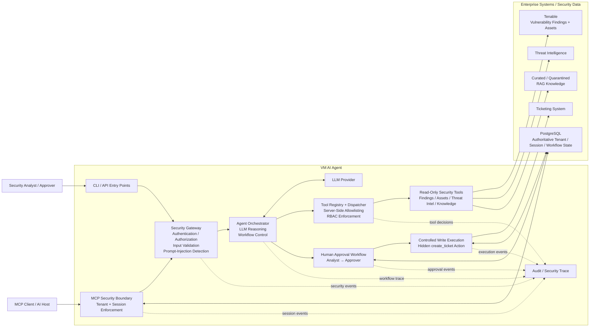
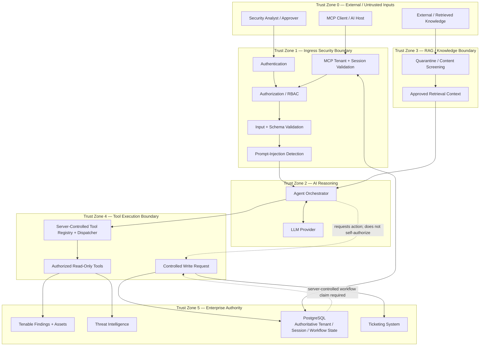
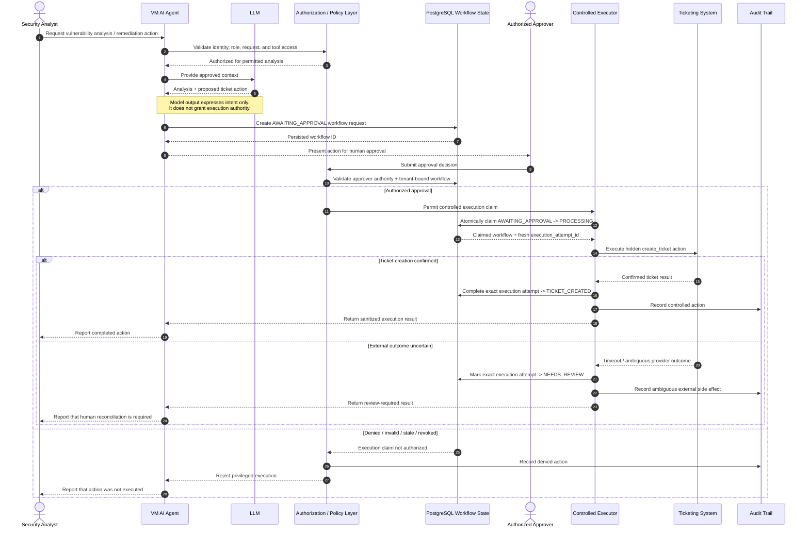
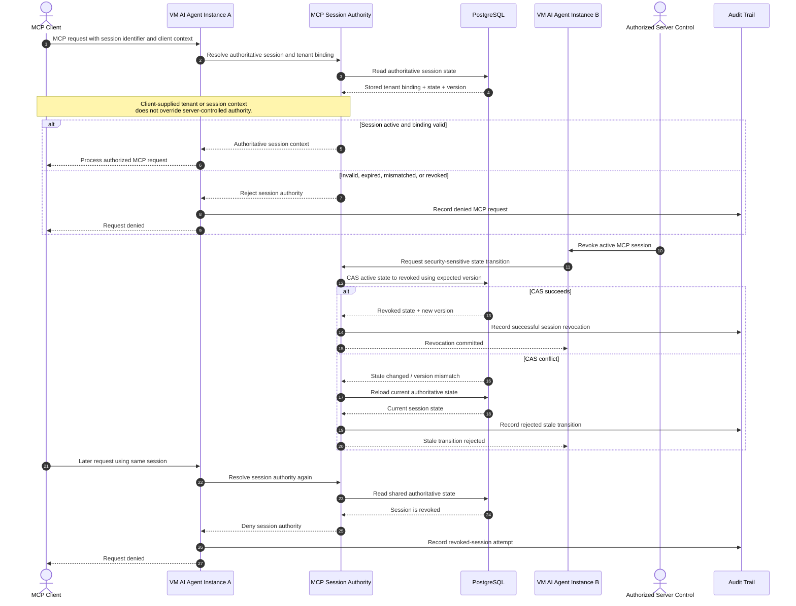
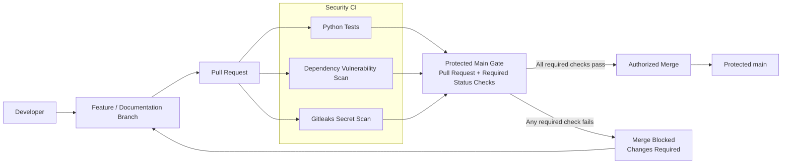
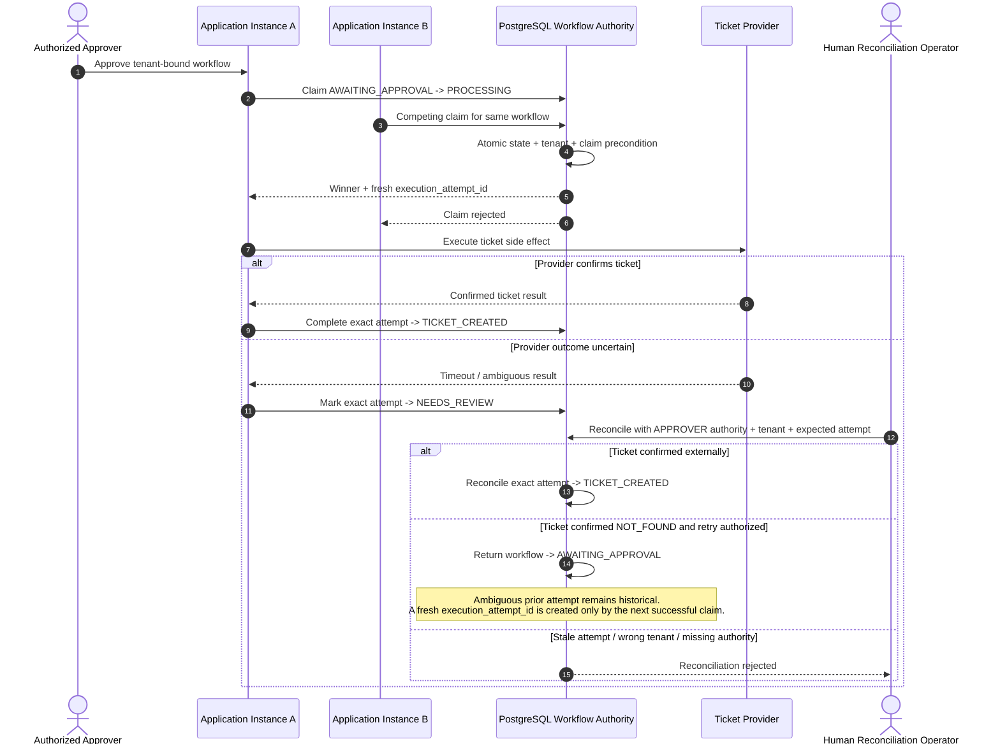

# VM AI Agent Architecture

This document is the version-controlled architecture reference for the VM AI Agent security architecture.

It captures the major application components, trust boundaries, controlled execution paths, authoritative session state, and secure software-delivery controls implemented by the project.

---

## 45.1 Overall VM AI Agent Architecture

The VM AI Agent separates user interaction, AI reasoning, tool execution, human approval, enterprise integrations, and security state into distinct control boundaries.

### Architectural Security Properties

- AI reasoning does not directly grant execution authority.
- Tool access is constrained through a server-controlled registry and dispatcher.
- Read-only security tools are separated from controlled write operations.
- Sensitive write operations require an explicit approval workflow.
- The `create_ticket` capability is not exposed directly to the LLM as a normal callable tool.
- Prompt-injection defenses execute before untrusted requests reach the model workflow.
- MCP tenant and session authority is enforced server-side rather than trusted from client-supplied context.
- PostgreSQL provides authoritative shared state for tenant, session, revocation, and workflow decisions.
- RAG content crosses a security boundary before becoming trusted knowledge.
- Security-sensitive actions generate auditable events.

---

## 45.2 AI Trust Boundaries / Data Flow

The primary security design principle is that data becomes progressively more trusted only after crossing explicit validation, authorization, and execution boundaries. User input, retrieved knowledge, and model output are never treated as execution authority by themselves.

### Trust-Boundary Security Properties

- External prompts, MCP requests, and retrieved content begin outside the trusted execution boundary.
- Authentication, authorization, validation, and prompt-injection checks occur before AI orchestration.
- MCP tenant and session claims are validated against server-controlled authority rather than accepted from client context.
- Retrieved knowledge is quarantined and screened before it can become trusted model context.
- The LLM can reason about actions but cannot grant itself tool or write authority.
- Tool execution is mediated by a server-controlled dispatcher and RBAC policy.
- Read operations are separated from controlled write operations.
- PostgreSQL is authoritative for security-sensitive tenant, session, revocation, and workflow state.
- A model-generated request cannot reach an enterprise write target without a valid server-controlled workflow claim.

---

## 45.3 Human Approval + Controlled Execution Flow

The controlled-execution workflow separates AI-generated intent from enterprise write authority. The model may recommend or request an action, but execution requires server-controlled workflow state, an independently authorized approver, and a successful atomic execution claim immediately before the hidden write capability can run.

### Controlled-Execution Security Properties

- LLM output is treated as a proposed action, not authorization.
- The privileged `create_ticket` capability is hidden from normal LLM-visible tool exposure.
- An `AWAITING_APPROVAL` workflow is persisted before a sensitive write can occur.
- Approval requires an independently authorized approver rather than self-approval by the requesting model or analyst workflow.
- Workflow authority is derived from server-controlled state rather than client-supplied approval claims.
- Execution is authorized only through an atomic `AWAITING_APPROVAL` to `PROCESSING` claim.
- Each successful claim receives a fresh `execution_attempt_id`, and the controlled executor operates on that exact claimed attempt.
- Competing instances cannot both successfully claim the same eligible workflow transition.
- A confirmed provider result transitions the exact attempt to `TICKET_CREATED`.
- An uncertain external side effect transitions the exact attempt to `NEEDS_REVIEW` rather than triggering a blind retry.
- Denied, stale, revoked, conflicting, or otherwise invalid claims fail closed before the enterprise write is authorized.
- Successful execution, ambiguous outcomes, and denied attempts can be represented in the audit trail.
- Enterprise side effects occur only after the complete authorization and atomic-claim chain succeeds.

---

## 45.4 MCP Tenant / Session / PostgreSQL Authority

MCP security state is controlled by the server rather than trusted from client-supplied tenant or session context. PostgreSQL provides shared authoritative state so security decisions remain consistent across application instances, including session revocation and security-sensitive compare-and-swap state transitions.

### MCP Session Authority Security Properties

- Client-supplied tenant and session context is treated as input rather than authority.
- Tenant and session authority is resolved from server-controlled state.
- PostgreSQL acts as the shared authoritative state store across application instances.
- A request is authorized only after the current session state and tenant binding are resolved.
- Session revocation is persisted centrally rather than maintained only in local process memory.
- A session revoked through one application instance is no longer authoritative when presented to another instance.
- Security-sensitive state transitions use compare-and-swap semantics to reject stale updates and conflicting transitions.
- The authoritative state is re-read when a CAS conflict occurs rather than accepting stale local assumptions.
- Invalid, mismatched, revoked, or stale session state fails closed.
- Session validation, revocation, and rejected transitions can be represented in the security audit trail.

The current project combines enterprise identity-provider-derived authenticated principals with server-controlled MCP authority and shared session state. Identity establishes the authenticated principal boundary, while tenant and session authority are resolved separately from authoritative server-side state rather than trusted from client-supplied tenant or session context.

---

## 45.5 Secure CI/CD + Protected Main

Repository delivery controls separate development activity from the trusted `main` branch. Changes are developed on isolated branches, submitted through pull requests, and evaluated by required security and quality checks before the normal merge path is allowed.

### Secure-Delivery Security Properties

- Development changes occur outside the protected `main` branch.
- The normal integration path requires a pull request.
- Python tests must satisfy the required repository status check before normal merge.
- Dependency vulnerability scanning is enforced as a required status check.
- Gitleaks secret scanning is enforced as a required status check.
- A failed required check blocks the normal protected-main merge path.
- Successful required checks permit the repository's controlled merge workflow to proceed.
- The merged commit becomes part of the protected `main` history only after the required gate is satisfied.
- These controls provide repository-level software-delivery governance without implying deployment, runtime infrastructure, or production release controls that are not implemented by this project.

---

## 49.1 Production Workflow Persistence + Distributed Execution Authority

Production workflow execution authority is persisted in PostgreSQL so security-sensitive state remains consistent across application instances. SQLite remains the local/test backend, while production execution decisions use the shared PostgreSQL workflow store.

### Production Workflow Authority Security Properties

- PostgreSQL is the shared production authority for workflow execution state across application instances.
- Only an eligible `AWAITING_APPROVAL` workflow can be atomically claimed for transition to `PROCESSING`.
- Every successful claim receives a fresh `execution_attempt_id`.
- Under a multi-instance race, exactly one claimant can win the same eligible workflow transition.
- Tenant-bound execution and recovery use trusted `SecurityContext` authority rather than raw client-supplied tenant values.
- An uncertain external side effect enters `NEEDS_REVIEW`; it is not automatically re-executed.
- Reconciliation requires APPROVER authority, the authoritative tenant binding, and the expected `execution_attempt_id`.
- Stale attempts, cross-tenant contexts, and missing required authority fail closed.
- A confirmed ticket reconciles to `TICKET_CREATED`.
- A confirmed `NOT_FOUND` result may return the workflow to `AWAITING_APPROVAL` only through human-authorized retry semantics.
- The ambiguous prior attempt remains historical; a fresh attempt is created only by the next successful atomic claim.
- Generic production `update_workflow` mutation authority is absent from the security-sensitive execution surface; dedicated transition operations enforce state and authority preconditions.
- Production startup validates workflow-store readiness and required schema state before authority-sensitive operation.
- Security CI provisions PostgreSQL 17 so shared-backend workflow authority, multi-instance race, stale-attempt, and tenant-isolation integration tests execute against the production store implementation.
